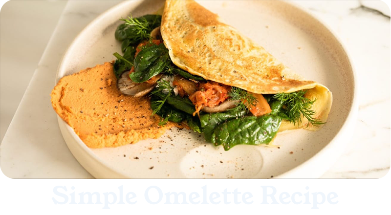
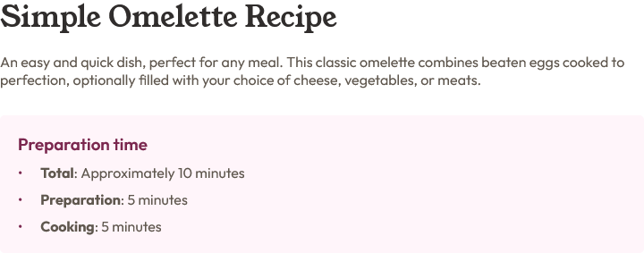
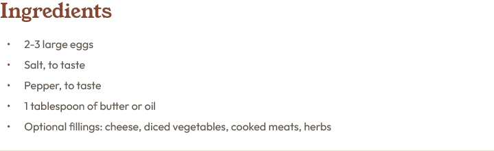
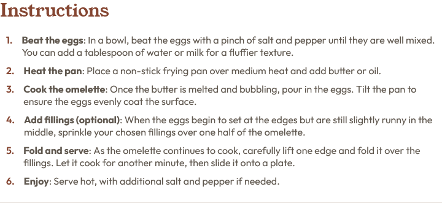
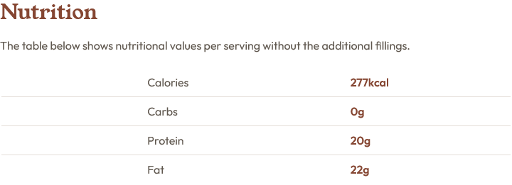

# Simple Omelette Recipe

A simple and easy-to-follow omelette recipe web page. This project features a clean, responsive design built with HTML and CSS. It includes clear instructions, ingredient lists, and nutritional information. Perfect for anyone looking for a quick meal.

## Table of contents

- Overview
- Built with
- What I learned
- Author

## Overview

This project is a **Simple Omelette Recipe** web page designed to showcase a minimalist, user-friendly recipe for preparing a classic omelette. The project utilizes **HTML** and **CSS** to create a responsive, visually appealing page with essential information about the recipe.

The page is structured to highlight key components of the recipe, including:

- **Introduction**: A brief description of the dish and its appeal.
- **Preparation Time**: Clear breakdown of how long each step (preparation, cooking, and total) takes.
  

- **Ingredients**: A simple list of ingredients required for the recipe, with an option for various fillings.
  

- **Instructions**: Step-by-step guide for preparing the omelette, including tips for customizing it with optional fillings.
  

- **Nutritional Information**: Basic nutrition facts (calories, protein, fat, carbs) for the recipe without additional fillings.
  

The design focuses on **usability** and **accessibility**, ensuring that the content is easy to read on both **mobile** and **desktop** devices. It uses a **clean layout** to make the recipe easy to follow while also providing a visually appealing experience.

- **Responsive Design**: Optimized for both mobile and desktop views.
- **Clean Layout**: A minimalist design that highlights the recipe and instructions.
- **Nutritional Information**: Displays basic nutrition facts for the omelette.
- **Easy-to-Follow**: Simple HTML structure and clear CSS styling.

This project serves as a **beginner-friendly exercise** in web development, demonstrating core principles of HTML structure and CSS styling while also providing a practical and visually pleasing example for users looking to make a simple omelette.

- Live Site URL: [Recipe Page](https://gabrielfelps.github.io/RecipePage/)

### Built with

- Semantic HTML5 markup
- CSS custom properties
- Flexbox
- Mobile-first workflow

### What I learned

I learned how to use the counter in CSS. In this project's code, the counter was used to create automatic numbering for ordered lists.

## Author

- Youtube - [@gabstillcoding](https://www.youtube.com/@gabstillcoding)
- Twitter - [@gabstillcoding](https://x.com/gabstillcoding)
